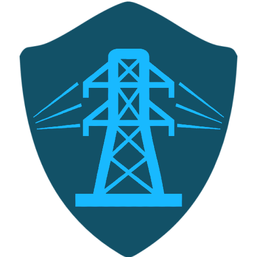

# LineGuard - Система инспекции линий электропередач



## Описание проекта

LineGuard - это современная система инспекции и мониторинга линий электропередач, основанная на технологиях машинного обучения и компьютерного зрения. Система использует алгоритмы YOLO (You Only Look Once) для автоматического обнаружения и анализа компонентов энергетической инфраструктуры на изображениях.

### Основные возможности

- **Автоматическое обнаружение объектов**: Идентификация компонентов линий электропередач с помощью YOLOv8
- **Анализ повреждений**: Выявление поврежденных и дефектных элементов инфраструктуры
- **Визуальная разметка**: Наложение bounding box'ов с указанием класса объекта и уверенности модели
- **Пакетная обработка**: Одновременная обработка нескольких изображений
- **Фильтрация результатов**: Возможность просмотра только поврежденных объектов
- **Интуитивный интерфейс**: Современный веб-интерфейс с поддержкой drag-and-drop

### Поддерживаемые объекты

Система может обнаруживать следующие типы объектов:

#### Нормальные компоненты:
- **Виброгаситель** (vibration_damper) - устройства для снижения вибрации проводов
- **Гирлянда изоляторов** (festoon_insulators) - традиционные стеклянные/фарфоровые изоляторы
- **Гирлянда полимерных изоляторов** (polymer_insulators) - современные полимерные изоляторы
- **Траверса опоры** (traverse) - несущая конструкция опоры линии электропередач
- **Знак безопасности** (safety_sign) - диспетчерские таблички, нумерация опор

#### Поврежденные объекты (⚠️):
- **Изолятор отсутствует** (bad_insulator) - отсутствующий или снятый изолятор
- **Поврежденный изолятор** (damaged_insulator) - сколотый, треснувший или поврежденный изолятор
- **Гнездо** (nest) - гнезда птиц на компонентах линии электропередач

## Структура проекта

```
LineGuard/
├── README.md                    # Документация проекта
├── package.json                 # Конфигурация Node.js проекта
├── server.js                    # Основной сервер Express.js
├── yolo_detector.py            # Python скрипт для YOLO детекции
├── public/                     # Статические файлы веб-интерфейса
│   ├── index.html             # Главная страница интерфейса
│   ├── script.js              # Frontend JavaScript логика
│   ├── style.css              # Стили интерфейса
│   ├── images/                # Изображения и иконки
│   │   ├── logo.png           # Логотип LineGuard
│   │   └── upload.png         # Иконка загрузки
│   └── fonts/                 # Шрифты (Comfortaa.ttf)
├── model/                     # Модели машинного обучения
│   └── LineGuard.pt           # Обученная YOLO модель
├── uploads/                   # Временная папка для загруженных файлов
```

## Требования к системе

### Программное обеспечение:
- **Node.js** версии 14.0.0 или выше
- **Python** 3.7+ с pip
- **Windows 10/11**, **Linux** или **macOS**

### Зависимости Node.js:
- express ^4.18.2 - веб-фреймворк
- multer ^1.4.5-lts.1 - обработка файловых загрузок
- cors ^2.8.5 - обработка CORS запросов
- nodemon ^3.0.2 (dev) - автоперезапуск сервера

### Зависимости Python:
- ultralytics - библиотека YOLOv8
- opencv-python - обработка изображений
- numpy - численные вычисления

## Установка и настройка

### 1. Клонирование проекта
```bash
git clone <repository-url>
cd LineGuard
```

### 2. Установка зависимостей Node.js
```bash
npm install
```

### 3. Настройка Python окружения
```bash
# Создание виртуального окружения (рекомендуется)
python -m venv .venv

# Активация виртуального окружения
# На Windows:
.venv\Scripts\activate
# На Linux/macOS:
source .venv/bin/activate

# Установка Python зависимостей
pip install -r requirements.txt
```

### 4. Проверка модели
Убедитесь, что файл модели `model/LineGuard.pt` присутствует в проекте. Это обученная YOLO модель для детекции компонентов линий электропередач.

## Запуск приложения

### Режим разработки
```bash
npm run dev
```

### Продакшн режим
```bash
npm start
```

Сервер будет запущен на `http://localhost:3000`

## Использование

### 1. Доступ к интерфейсу
Откройте веб-браузер и перейдите по адресу `http://localhost:3000`

### 2. Загрузка изображений
- **Drag & Drop**: Перетащите изображения в область загрузки
- **Выбор файлов**: Нажмите на область загрузки для выбора файлов
- **Поддерживаемые форматы**: JPG, JPEG, PNG, TIFF, BMP
- **Ограничение размера**: Максимум 10MB на файл

### 3. Обработка изображений
- Система автоматически обработает загруженные изображения
- Результаты отображаются в виде списка с превью
- Статус обработки: "Обработка...", "✓ Обработано", "✗ Ошибка"

### 4. Просмотр результатов
- **Список изображений**: Показывает все обработанные изображения
- **Просмотр деталей**: Кликните на изображение для детального просмотра
- **Визуальная разметка**: Bounding box'ы с информацией о классе и уверенности

### 5. Фильтрация результатов
- **Кнопка "Только поврежденные"**: Показывает только объекты, требующие внимания
- **Цветовая кодировка**: Разные цвета для разных типов объектов
- **Нумерация**: Отдельная нумерация для поврежденных и нормальных объектов

### 6. Управление интерфейсом
- **Назад к списку**: Возврат к списку изображений
- **Очистить все**: Удаление всех изображений из интерфейса
- **Закрыть изображение**: Закрытие детального просмотра

## API Endpoints

### GET /
Главная страница веб-интерфейса

### POST /upload
Загрузка и обработка изображения
- **Content-Type**: multipart/form-data
- **Параметр**: `image` (файл изображения)
- **Ответ**: JSON с результатами детекции

```json
{
  "success": true,
  "imagePath": "uploads/image-1234567890.jpg",
  "detections": [
    {
      "class": "insulator",
      "confidence": 0.95,
      "bbox": [120, 50, 80, 120]
    }
  ]
}
```

### GET /health
Проверка состояния сервера

## Техническая архитектура

### Backend (Node.js/Express)
- **Файл**: `server.js`
- **Функции**: Обработка HTTP запросов, управление файлами, запуск Python скриптов
- **Безопасность**: Проверка типов файлов, ограничение размера (10Gb)
- **Очистка**: Автоматическое удаление файлов через 5 секунд после обработки

### YOLO Detection (Python)
- **Файл**: `yolo_detector.py`
- **Библиотека**: Ultralytics YOLOv8
- **Модель**: `model/LineGuard.pt` c mAP@0.5 - 0.76
- **Производительность**: Обработка на CPU, таймаут 30 секунд

### Frontend (HTML/CSS/JavaScript)
- **Интерфейс**: Современный responsive дизайн
- **Логика**: `public/script.js` - обработка пользовательских действий
- **Стили**: `public/style.css` - профессиональное оформление
- **Шрифты**: Comfortaa для улучшенной читаемости

### Визуализация
- **Canvas**: Наложение bounding box'ов на изображения
- **Координаты**: Автоматическое масштабирование под размер отображаемого изображения
- **Интерактивность**: Hover эффекты, анимации загрузки

## Конфигурация

### Переменные окружения
- `PORT`: Порт сервера (по умолчанию 3000)

### Ограничения
- **Размер файла**: Максимум 10Gb
- **Форматы**: JPEG, JPG, PNG, GIF, BMP, TIFF
- **Время обработки**: Таймаут 30 секунд на изображение
- **Очистка файлов**: Автоматическое удаление через 5 секунд

## Производительность

### Оптимизация
- **Последовательная обработка**: Файлы обрабатываются по очереди для экономии ресурсов
- **Подавление вывода**: YOLO работает в тихом режиме для улучшения производительности
- **Очистка памяти**: Автоматическое удаление временных файлов
